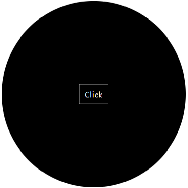

 # one-element

---
One Element provides basic ui elements necessary for wearable.<br>By using this, you can easily configure the screens required for application development.

## Usage

---

Use it in your HTML:
```javascript
<html>
  <head>
    <script src="one-element.umd.js"></script>
  </head>
  <body>
    <one-circle>
      <one-button>Click</one-button>
    </one-circle>
  </body>
</html>
```



## Development

```shell
npm install
npm run watch
npx http-server
# connect to http://localhost:8080
```
